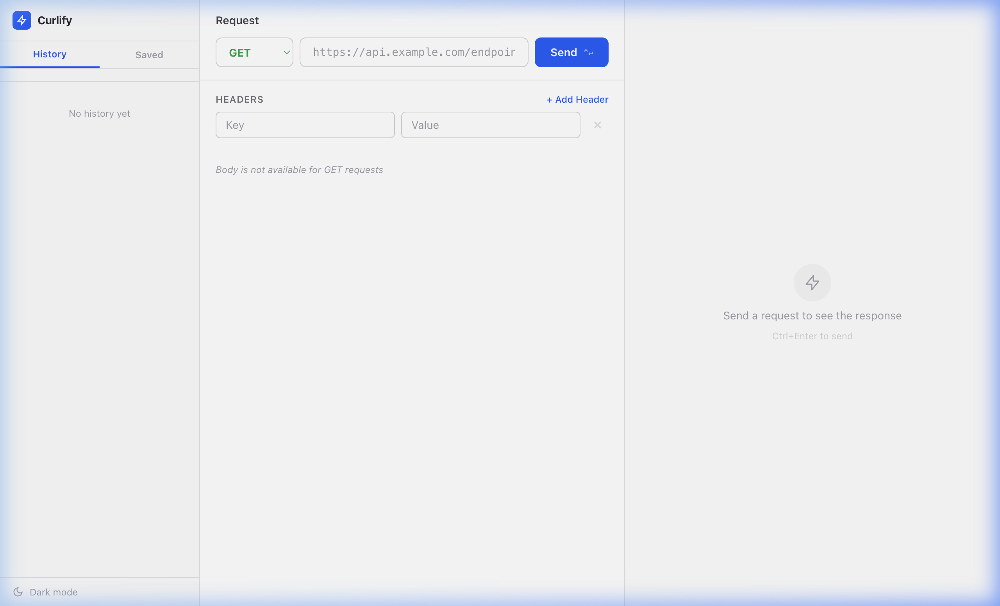
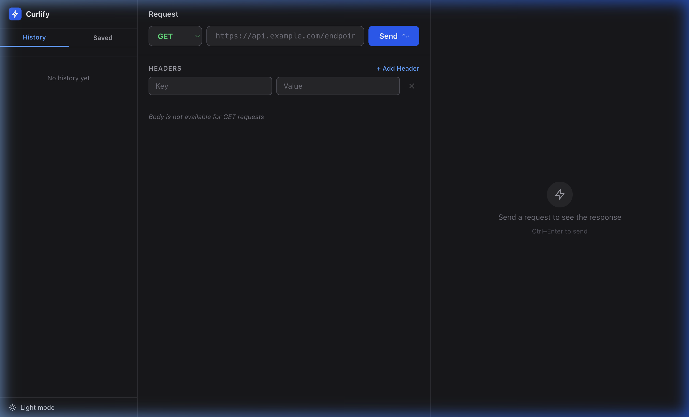
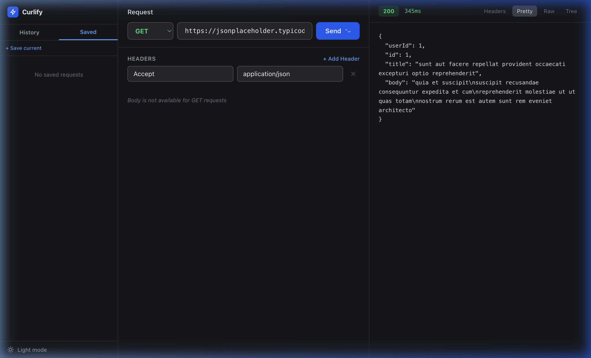

# Curlify 🚀

**Curlify** is a sleek, modern, and open-source API client built for developers who value performance and a clean UI. Test, debug, and manage your API requests with ease.



## ✨ Features

- **Intuitive Request Builder**: Select methods (GET, POST, etc.), enter URLs, and add headers/body parameters with a minimalist interface.
- **Dynamic Response Viewer**: View API responses in **Pretty**, **Raw**, or **Tree** modes. Automatically highlights JSON for readability.
- **Smart History Tracking**: Every request you send is saved locally so you can revisit it later.
- **Collections & Bookmarks**: Save your most-used requests for quick access in the "Saved" tab.
- **Beautiful Dark Mode**: Fully responsive, high-contrast dark theme optimized for eye comfort.
- **Performance Focused**: Built with React 19 and Vite for near-instant load times.

## 🛠️ Tech Stack

- **Framework**: [React 19](https://react.dev/)
- **Build Tool**: [Vite](https://vite.dev/)
- **State Management**: [Zustand](https://zustand.docs.pmnd.rs/)
- **Styling**: [Tailwind CSS 4](https://tailwindcss.com/)
- **Storage**: Browser LocalStorage for persistent history and saved requests.

## 🚀 Getting Started

### Prerequisites

- [Node.js](https://nodejs.org/) (v18.0.0 or higher)
- [npm](https://www.npmjs.com/) or [yarn](https://yarnpkg.com/)

### Installation

1.  **Clone the repository**:
    ```bash
    git clone https://github.com/yourusername/curlify.git
    cd curlify
    ```
2.  **Install dependencies**:
    ```bash
    npm install
    ```
3.  **Start the development server**:
    ```bash
    npm run dev
    ```
4.  **Open in your browser**:
    Navigate to `http://localhost:5173` (or the port specified in your terminal).

## 📸 Screenshots

| Dark Mode | History & Saved |
| :---: | :---: |
|  |  |

## 🤝 Contributing

Contributions are welcome! If you have a feature request or found a bug, please open an issue or submit a pull request.

1.  Fork the Project
2.  Create your Feature Branch (`git checkout -b feature/AmazingFeature`)
3.  Commit your Changes (`git commit -m 'Add some AmazingFeature'`)
4.  Push to the Branch (`git push origin feature/AmazingFeature`)
5.  Open a Pull Request

## 📄 License

Distributed under the MIT License. See `LICENSE` for more information.

---

Built with ❤️ by [Swadesh](https://github.com/swadesh)
